# 為替レートの変動と日本人海外出国者数の関係

23W208　畑山小雪

23W007　浅林萌

（指導教官：名方佳寿子）

## 要旨
本論文の背景には、バブル崩壊後の経済停滞期でありながら日本人の海外出国者数が増加した現象があり、為替変動が個人消費や観光需要に与える影響を解明する上で重要である。目的は、1990年代の海外出国者数の推移に着目し、為替レートの変動が渡航者数に及ぼした影響を実証的に明らかにすることである。データと分析方法としては、主要な渡航先を対象とし、為替レートや地理的距離、世界遺産数、1人当たりGDP、貿易額などを説明変数に用いた回帰分析と動向整理を実施した。結果として、円高局面では旅行費用負担の軽減により出国者数が急増し、円安局面では伸び悩むなど、為替レートが渡航需要を方向付ける主要因であることが統計的に確認された。さらに、地理的近接性や貿易を通じた経済的結びつき、観光資源といった多様な要因も複合的に作用していることが示された。

## 目次
1．はじめに

2．先行研究　林・藤原(2008)

2．先行研究　金(2011)

2．先行研究　吉水・瀬戸(2018)

2．先行研究

2．先行研究

2．先行研究

3．近年の海外出国者の人数の動向について

4．海外出国者が増加する理由とその背景

5．人気のあった国とその理由について

6．日本人の海外出国者が増えることによる影響について

7．回帰分析

8.結論

## 1章　はじめに
　1990年代の日本は、バブル経済の崩壊とその後の長期的な経済不況という、戦後日本経済における最大の転換点を迎えた時代であった。株価や地価の下落、企業の業績不振が家計の可処分所得や消費マインドに影を落とす一方で、日本人の海外出国者数は1990年の約1,000万人から1998年には1,500万人を超える水準へと、全体として拡大傾向をたどった。国内の経済低迷というマクロ的なマイナス要因がありながらも、なぜ海外渡航需要が維持・拡大したのかという現象は、一見すると経済的合理性と矛盾するように捉えられる。ここに、本研究のテーマが持つ重要な学術的・現実的意義が存在する。すなわち、経済の低迷と、1995年の歴史的な超円高やその後の円安といった激しい為替変動が交錯する中で、マクロ経済的要因や国際環境が個人の旅行行動にどのようなメカニズムで作用したのかを解き明かすことは、観光経済学および国際金融論の観点から極めて重要である。

　これまでの先行研究において、日本人の海外旅行市場や観光行動に関する分析は多角的に進められてきた。吉水・瀬戸（2018）は1964年の海外旅行自由化以降の歴史的経緯に着目し、旅行の大衆化や「スケルトン・ツアー」の普及によるスタイル変化を明らかにしている。また、金（2011）や山下（2018）は若者の海外旅行離れや心理的阻害要因（行動統制感や態度）に焦点を当て、行動と意識の乖離や二極化の実態を実証的に検証してきた。さらに、小林（2011）や林・藤原（2008）は経済的制約や就職活動時期の重複といった構造的阻害要因、および観光動機の多様性を論じている。このように、旅行者の心理構造や歴史的・社会的背景に関する研究は数多く蓄積されている。しかしながら、これらの先行研究の多くは、個人の心理的動機やマクロ的な歴史的変遷を論じる一方で、旅行者のコストや購買力を直接的かつ動的に規定する最大のマクロ経済変数である「為替レートの変動」が、実際の出国者数や渡航先選択にどのような時間的ラグや感応度を持って影響を及ぼしたのかについて、十分に定量的な検証を行っているとは言い難い。

　そこで本論文の目的は、1990年代における日本人海外出国者数の推移に着目し、為替レートの変動が海外渡航者数およびその動向にどのような影響を与えたのかを、経済学的視点から実証的に明らかにすることである。本研究では、1990年代の主要な渡航先（今回はアメリカ、韓国、中国、香港、台湾、イタリア）を対象とした動向整理に加え、為替レート、地理的距離、世界遺産数、1人当たりGDP、貿易額（輸出入額）を説明変数に設定した回帰分析を用いた。分析の結果、為替レートの変動が海外渡航需要を方向付ける極めて重要な決定要因であることが確認された。特に1995年の超円高局面では円の購買力向上によって旅行費用負担が軽減され出国者数が急増した一方、1997年以降の円安局面では伸び悩みがみられ、「円高が進行するほど海外旅行者数が増加する」という統計的に有意な傾向が裏付けられた。さらに、為替だけでなく地理的近接性や貿易を通じた経済的結びつき、観光資源といった多様な要因が複合的に作用していることも示された。

　本論文の1章以降の構成は以下の通りである。第2章では先行研究の整理を行い、第3章では1990年代における経済成長や所得水準、インフラ発展などの社会的・経済的背景を多角的に考察する。第4章では出国者増加の背景と理由を扱い、第5章では当時の主要な渡航先を取り上げ、国別の動向や旅行目的の内訳、各種経済指標との関係を整理する。第6章では出国者の増加がもたらす影響を文化的・経済的・社会的な側面から論じ、第7章では日本人出国者総数を被説明変数とした回帰分析を実施して統計的な観点から影響要因を検証する。最後に第8章（結論）では、本論文全体の総括を行い、分析から得られた知見と今後の展望をまとめる。

## 2章　先行研究
　　林・藤原(2008)では「訪問地域、旅行形態、年令別にみた日本人海外旅行者の観光動機」という論文において、日本人の海外旅行における観光動機が、目的地や年令、旅行形態によってどのように異なるのかを調査し、その構造を明らかにしようとしている。

　本論文では、観光行動を規定する「なぜ旅行に行くのか」という動機の側面に着目して論述している。著者は、日本人旅行者のニーズが多様化する中で、個人の属性が動機に与える影響を解明することが重要と考え、因子分析や多次元尺度構成法（MDS）を用いて分析を行っている。また、目的地別の特性や、パッケージ旅行と個人旅行といった形態の違いが、どのような心理的欲求を反映しているのかについても大規模な実証データから分析していた。

　論文において、Lee&Crompton(1992)のTNS、Fodness(1994)、Ryan&Glendon(1998)、佐々木(2002)、Schul&Crompton(1983)の観光動機尺度を参考にした36項目の質問紙調査の結果が使われている。データは関西国際空港の国際線出発ロビーにおいて、出国待ちの日本人海外旅行者1,014名を対象に実施された。

　分析方法は、まず因子分析を用いて「刺激性因子」「文化見聞因子」「現地交流因子」「健康回復因子」「自然体感因子」「意外性因子」「自己拡大因子」の七つの動機因子を抽出している。さらに、これらを「自己志向－他者志向」および「予測可能性－不確実性」という二軸の平面上に配置し、年令層・訪問地域・旅行形態ごとの動機傾向を比較することで、それぞれの属性における心理的特徴を裏付けていた。

　著者は論文において、日本人の観光動機はライフステージや環境選択と密接に関係していると述べた。そして、年令が高くなるにつれて動機はスリルを求める「新奇性」から、歴史や自然に触れる「本物性」へと移行すること、また個人手配旅行者は不確実な状況における「意外性」や「交流」を求める傾向が強いと結論付けた。

　本論文を読んで、年令を重ねるごとに「刺激」よりも「本物」を求めるようになるという変化が、統計的にも証明されている点に納得した。また、訪問地域によって動機が異なるという結果は、旅行者が自分の欲求を叶えられる場所を無意識に選び分けていることを示しており、非常に興味深かった。疑問点としては、この調査が2000年代に行われたものであるため、現在のSNS全盛期における旅行者の動機（例えば「映え」や承認欲求など）を調べた場合、どのような新しい因子が出現するのかという点である。これらを比較することで、より現代的な傾向が知れるのではないかと疑問に思った。

　また、私が取り組もうとしている卒業論文のテーマにおいても、対象者の動機が選択にどう結びついているかを分析する手法は非常に参考になると考えられた。

　金(2011)では「日本の若者はなぜ海外旅行に行かないのか――東アジアにおける地域間比較をとおして――」という論文において、若者の海外旅行離れが指摘される中、若年層の海外旅行への意図（意思）がどのような心理的要因によって形成されるのかを、東京、広州、ソウルの3都市の大学生を比較することで明らかにしようとしている。  

　本論文では、人間の行動意図を説明する「計画的行動理論（TPB）」に着目して論述している。著者は、海外旅行の意図が「海外旅行そのものに対する態度（楽しい・面白いなど）」「行動統制感（能力、お金、時間などの障壁）」「主観的規範（周りや社会からのプレッシャー）」という3つの要因からどう影響を受けるかを検証している。

　論文においては、2010年5月に東京・広州・ソウルの大学生を対象として実施した質問紙調査のデータが使用されている。アンケートでは「海外旅行は楽しいと思うか」「海外旅行は必要だと思うか」といった海外旅行そのものに対する態度、「海外旅行を実現する能力があると思うか」「海外旅行はお金や時間がかかりすぎると思うか」といった行動統制感、「周囲の人は、私が海外旅行へ行くべきだと思っているか」「周囲の人は、実際に海外旅行へ行っているか」といった主観的規範、さらに「海外旅行へ行きたいと思うか」という旅行意図について、7段階評価で回答を得ている。

分析方法は、まず質問項目ごとの平均値を比較し、日本・中国・韓国の若者の海外旅行に対する意識の違いを明らかにしている。その後、計画的行動理論（TPB）に基づき、多母集団分析（複数の集団を同じ分析モデルで比較する分析手法）を用いて、3都市それぞれにおいて「態度」「行動統制感」「主観的規範」が海外旅行意図にどの程度影響を与えるかを比較している。また、各要因から海外旅行意図への影響の強さ（パス係数）を比較することで、日本・中国・韓国における意図形成の特徴や違いを明らかにしていた。

著者は論文において、海外旅行への意図形成に向けた各要因の影響力は都市によって異なると述べた。「海外旅行そのものに対する態度」の影響は東京の若者が広州、ソウルに比べ著しく強く表れており、逆に「主観的規範」の影響は広州、ソウルの方が東京に比べ著しく強かった。一方で「行動統制感」の有意な直接的影響はいずれの都市でもみられず、東京の若者は周囲に無頓着である一方、ソウルの若者は周囲の影響で魅力が増し、広州の若者は経済的な阻害要因が態度に負の影響を与えていると結論付けた。  

　本論文を読んで、海外旅行に対する意図形成の仕組みが3都市で大きく異なるという結果に納得した。特に東京の若者が「主観的規範」に直接的にも間接的にも影響を受けず無頓着であるという指摘は、現代の日本の若者の個人主義的な側面をよく表していると感じた。また、広州の若者が海外旅行自体は高く評価しているものの、経済状況からくる阻害要因（行動統制感）が「海外旅行そのものに対する態度」そのものを下げてしまっているという因果関係の構造も非常に興味深かった。疑問点としては、このデータにおける非標準化係数の比較において、行動統制感から意図への直接的な影響がみられなかったとされているが、経済的な障壁や時間、言葉の障壁が、実際に「意図」ではなく行動を起こす段階でどれほど強く作用するのかと考えた。

　また、私が取り組もうとしている卒業論文のテーマにおいても、単に経済的要因を測るだけでなく、海外渡航の心理的意図という要素を分解して相関・因果関係を調べる手法は非常に参考になると考えられた。

　吉水・瀬戸(2018)では「日本人の海外観光旅行の変容―海外旅行自由化以降に注目して―」という論文において、1964年の海外旅行自由化以降、日本人の海外旅行がどのように大衆化し変容してきたのか、その歴史的経緯と渡航者数の増減要因を整理し、現代の若者の海外旅行離れに対する今後の海外旅行市場の課題を明らかにしようとしている。  

　本論文では、日本の海外旅行史における「渡航者数の推移」と「旅行商品のスタイルの変化」に着目して論述している。著者は、かつて一部の富裕層に限定されていた海外旅行が、政府の政策や航空技術の革新、旅行会社による商品開発によって庶民のものへと変化していく過程を分析している。また、時代ごとの社会情勢（円高の進行やテロ、感染症など）が渡航需要に与えたプラス・マイナスの影響についても詳細に分析していた。  

　論文において、国土交通省官公庁による『観光白書』や外務省の「海外在留邦人数調査統計」から得られた、海外旅行自由化前から現代にいたる日本人出国者数の長期的推移データが使われている。  

　分析方法は、自由化以降の歴史を「自由化初期」「海外旅行ブーム」「低成長時代」などの段階ごとに分類し、当時の為替レート、航空運賃制度（団体割引運賃やチャーター便の認可）、大学卒初任給とツアー代金の比較などを通して、海外旅行が身近になっていく過程を検証している。  

　著者は論文において、日本人の海外旅行は経済成長やパッケージツアーの誕生、運輸省の「テンミリオン計画」などによって急激に大衆化したと述べた。そして、現代においては海外旅行が特別なものではなくなり、往復航空券と宿泊のみがセットされた「スケルトン・ツアー」を利用し、安価で短期間にショッピングやグルメを目的とするスタイルが定着したと結論付けた。  

　本論文を読んで、海外旅行が自由化された当初のツアー代金が当時の大卒給与の数十倍もしていたことや、外貨持ち出し制限のために現地でお土産を買う余裕が全くなかったことなどの具体的な背景を知り、現代の旅行環境に至るまでに劇的な変化が繰り返されてきたということを実感した。また、渡航者数の増減がオイルショックやテロといった国際情勢の負の要因に極めて敏感に反応している点も、グラフの推移からよく理解できた。疑問点としては、「若者の海外旅行離れ」について、単に魅力を見いだせずにいるという心理的側面だけでなく、若年層の実質可処分所得の推移や非正規雇用の増加といった経済的背景、あるいはインターネット・SNSの普及による疑似体験の定着といった構造的な要因についても、より定量的なデータを用いて比較すれば、さらに詳しい傾向や現代的課題を知ることができるのではないかと疑問に思った。

　また、私が取り組もうとしている卒業論文のテーマにおいても、観光行動や消費行動などの現代的な課題を論じる際に、過去数十年の歴史的変遷や制度緩和の過程をあらかじめ整理しておくことが必要ではないかと感じた。

## 3章　近年の海外出国者の人数の動向について
　　1990年代は、日本人の海外渡航が急速に一般化した時代であった。高度経済成長を経て国民所得が増大し、生活の余裕が生まれたことに加え、国際的な交流の拡大や観光地としての海外の魅力が広く認知されるようになったことが背景にある。特に1990年から1998年にかけての時期は、バブル経済の崩壊とその後の長期不況という日本経済の大きな転換点と重なり、同時に円相場の変動も顕著であった。この為替レートの変動が日本人の海外渡航に少なからず影響を与えており、出国者数の推移を理解することは、本論文において為替レートと海外渡航の関係を明らかにする上で極めて重要である。

　まず1990年代初頭、日本は依然としてバブル経済の余韻を残していた。1990年当時の日本人海外出国者数はおよそ1,000万人を突破し、過去最高を更新していた。国民の可処分所得は高く、また「海外旅行は特別な贅沢」から「身近な娯楽」へと意識が変わりつつあった。航空会社による格安チケットの普及や旅行代理店のパッケージツアーの多様化がこれを後押しした。加えて、円高基調が進んでいたことで、海外旅行先での購買力が高まり、「円高は海外旅行の追い風」という現象が顕著に表れた。

　しかし1991年以降、バブル経済の崩壊に伴い国内経済は後退局面に入った。株価と地価の下落が家計に影響を及ぼし、消費全般が抑制される中で、海外渡航の増加にも一時的な鈍化が見られた。それでも1990年代前半の日本人海外出国者数は、全体としては漸増傾向を維持している。これは一見すると経済不況と矛盾するように思えるが、背景には円高の継続があった。1995年には1ドル＝80円台という歴史的な超円高水準に達し、この時期にはむしろ海外旅行が割安となったため、出国者数は記録的な水準に達した。つまり、経済の低迷というマイナス要因を為替レートの有利な変動が補い、むしろ旅行需要を押し上げる結果となったのである。

　一方、1997年から1998年にかけては状況が変化する。アジア通貨危機が発生し、為替市場は大きく揺れ動いた。円は急速に下落し、ドルに対しても円安傾向が進んだことで、海外旅行の費用は上昇した。さらに国内経済も消費税増税や金融不安などにより停滞感を強め、可処分所得の伸びも鈍化していた。こうした要因が重なり、1997年以降の出国者数は伸び悩み、1998年には減少傾向が見られる。この現象は、為替レートの変動が人々の旅行行動に直接的な影響を与えることを裏付ける重要な事例である。

　1990年代を通じて見れば、日本人の海外出国者数は全体として増加傾向をたどった。1990年にはおよそ1,000万人規模であったのに対し、1998年には1,500万人を超える水準にまで拡大している。しかし、その内部には円高局面での急増や、円安・不況下での停滞といった変動が存在する。この変動こそが、本論文で扱う「為替レートの変動と海外渡航者数の関係」を考察する上での核心である。単に「景気が良いから旅行が増える」「不況によって減る」といった単純な構図ではなく、為替相場という国際経済的な要因が旅行需要を方向付けていたことが分かる。

　この視点からすれば、1990年代は為替レートが日本人の旅行行動に与える影響を観察する格好の時期であると言える。円高によって海外旅行が「より身近な消費行動」として定着した一方で、円安局面や経済的停滞によってその拡大が抑制されるという対比が明確に見られるからである。本章で示した出国者数の動向を踏まえることで、次章以降では為替レートの変動と渡航先の選好、さらに観光産業や消費行動への影響について、より具体的な分析を進めることが可能となるだろう。

## 4章　海外出国者が増加する背景と理由
　　1990年代における日本人海外出国者数の増加は、単なる数値的な現象ではなく、社会経済的環境の変化と人々の意識の変容が相互に作用した結果である。この章では、為替レートの要因に加えて、なぜ多くの日本人がこの時期に海外へ向かうようになったのか、その背景と理由を多角的に検討する。

　第一に挙げられるのは、経済成長と所得水準の上昇である。高度経済成長期を経て1980年代後半には国民一人当たりのGDPが大幅に向上し、日本は先進国の一角として豊かな生活水準を享受するようになった。1990年代はバブル崩壊後の経済停滞期に入るが、それ以前の資産効果と蓄積された購買力はなお人々の生活に余裕をもたらしていた。とりわけ1990年代前半には、円高の進行により海外旅行が「コストパフォーマンスの高い娯楽」として認識されるようになり、経済的不安を抱えつつも旅行需要は衰えなかった。つまり、「円高は家計の防波堤」として機能し、出国者数の増加を支えたのである。

　第二に、航空輸送網の拡充と旅行商品市場の発展がある。1990年代には航空会社の国際路線が大幅に拡大し、特にアジア近隣諸国への直行便が増加した。また旅行代理店によるパッケージツアーは多様化を極め、「3泊4日で行ける韓国・台湾」や「格安ヨーロッパ周遊」などが積極的に売り出された。これにより、従来は一部の富裕層に限られていた海外旅行が、一般のサラリーマンや学生にも開放され、若年層を中心に需要が拡大した。こうした旅行商品の「大衆化」は、海外渡航を特別な行為から日常的な娯楽へと位置づけ直す大きな転換点となった。

　第三に、国際社会との接触機会の増大も重要である。冷戦終結後の1990年代は、グローバル化が急速に進展した時代であった。企業の海外進出や国際取引の増加に伴い、ビジネス目的の渡航は拡大した。また、国際交流や留学プログラムも増え、学生や若者が海外に関心を持つ機会が広がった。さらに1990年代半ば以降は、テレビ番組や雑誌で「海外旅行の魅力」が盛んに取り上げられ、マスメディアが旅行需要を刺激する役割を果たした。このように、情報流通の発展は旅行行動を後押しする大きな要因であった。

　第四に、消費文化の変化と価値観の多様化が背景にある。バブル経済期にはブランド品や高級消費が重視されたが、崩壊後は「モノ消費」から「コト消費」へと関心が移行し始めた。海外旅行は単なる娯楽ではなく、異文化体験や自己表現の手段として若者を中心に受け入れられた。特に「世界遺産」や「リゾート地」などは1990年代に強く注目され、人々は旅行を通じて新しいライフスタイルを追求するようになった。こうした価値観の転換が、出国者数の増加を支える文化的基盤となった。

　第五に、為替レートの影響を改めて確認する必要がある。1990年代は円高・円安が交錯する激動の時代であった。1995年には歴史的な超円高により、海外旅行が「割安」で楽しめる状況が訪れ、多くの国民が海外へ出向いた。一方で1997年以降の円安局面では旅行費用が上昇し、渡航先や旅行スタイルに変化が見られた。たとえば、円高時にはヨーロッパやアメリカへの長距離旅行が増えたのに対し、円安時には近距離のアジア旅行が選好される傾向が強まった。このように、為替レートは単に渡航者数に影響するだけでなく、渡航先の選択や旅行形態をも規定する要因であった。

　最後に、制度的要因も無視できない。1990年代にはパスポートの発給手続きが簡便化され、取得者数が急増した。また観光ビザの免除や短期滞在ビザの緩和が進み、日本人旅行者の行動範囲は拡大した。さらに国際空港の整備や地方空港からの直行便増加により、東京や大阪以外の地域住民にとっても海外旅行が身近な存在となった。これらの制度的・インフラ的整備が出国者数の増加を下支えしたことは明らかである。

　総じて、1990年代における日本人海外出国者数の増加は、単一の要因に還元できるものではなく、経済・交通・文化・制度といった複合的要因の相互作用によって実現したものである。その根底には「豊かさの享受」と「国際社会への関心」という二つの大きな潮流が存在していた。そしてこれらの要因は、為替レートの変動という外的要因と結びつくことで、渡航者数の推移に具体的な形を与えたのである。本章で示した背景を理解することにより、次章以降では為替レートが旅行行動に与える具体的な影響を、より詳細に分析するための基盤が整うこととなる。

## 5章　人気のあった国とその理由について
　1990年代、日本はバブル崩壊後の景気低迷期にあったが、1987年に策定された海外旅行倍増計画（テン・ミリオン計画）やそれに伴う旅行業界の発展、1970年に発売されたパッケージツアーの普及により個人の渡航が容易になった。渡航先として人気のあった国はアメリカ合衆国（ハワイ・グアム等含む）、韓国、中国、香港、台湾の五カ国である。本章では、これらの五カ国に世界で最も世界遺産の登録数が多いイタリアを加えた六カ国への渡航理由について考える。

**表1.海外出国者人数（単位：万人）**

|        | アメリカ | イタリア | 韓国 | 台湾 | 中国 | 香港 |
|--------|----------|----------|------|------|------|------|
| 1990年 | 368      | 11       | 137  | 88   | 37   | 100  |
| 1992年 | 367      | 17       | 131  | 73   | 58   | 94   |
| 1994年 | 403      | 28       | 155  | 74   | 77   | 96   |
| 1996年 | 518      | 48       | 144  | 83   | 102  | 151  |
| 1998年 | 495      | 49       | 190  | 77   | 100  | 65   |

https://www.moj.go.jp/isa/policies/statistics/toukei_ichiran_nyukan.html
### (１) アメリカ合衆国

　1990年代の日本において、アメリカ合衆国は主要な渡航先の一つであった。外交・公用・短期商用などの業務目的や、学術研究・留学などの学業目的による渡航が多く見られた。また観光においても、アメリカ本土のみならず、ハワイやグアムといった太平洋のリゾート地が高い人気を保っていた。特にハワイは「日本人の海外旅行の象徴」として定着しており、休暇・新婚旅行などの目的で訪れる例が顕著であった。  
　 為替相場においては1980年代後半の急激な円高局面を経たのち、1990年代は比較的安定的に推移した。為替変動の穏やかさは旅行費用の見通しを立てやすくし、一般消費者にとっても海外旅行への心理的障壁を低下させる要因となった。また、アメリカの観光産業は日本人旅行者向けのインフラ整備が進んでおり、日系航空会社・旅行代理店によるパッケージツアーの充実も渡航増加に寄与した。

**表2.アメリカへの日本人出国者総数内訳 (単位：%)**

| アメリカ | 日本人出国者総数 | 仕事等 | 学業等 | 居住等 | 観光等 |
|---|---|---|---|---|---|
| 1990 | 100.0 | 10.5 | 2.5 | 2.0 | 84.9 |
| 1992 | 100.0 | 9.1 | 2.9 | 2.0 | 85.9 |
| 1994 | 100.0 | 8.8 | 2.8 | 1.8 | 86.6 |
| 1996 | 100.0 | 9.2 | 2.4 | 1.5 | 86.9 |
| 1998 | 100.0 | 9.4 | 2.3 | 1.8 | 86.6 |
### (２) 韓国

韓国は日本から非常に近距離に位置する外国であり、1990年代においても短期滞在型の旅行先として人気が高かった。ソウルや釜山を中心に、食文化・買い物・エステなどの体験型観光が女性層を中心に注目を集めた。特に週末旅行や2〜3日程度の短期旅行が手軽に実現できる点が支持された。  
　政治的には1990年代初頭に歴史認識をめぐる摩擦も見られたが、1998年の金大中大統領と小渕恵三首相による「日韓共同宣言」によって文化交流促進の方針が明確化し、渡航環境は好転した。1990年代後半には格安航空券の普及とともに、若年層を中心にリピーターが増加していった。このように、地理的近接性と経済的負担の少なさ、そして文化的親近感が相まって、韓国は1990年代を通じて人気の旅行先であり続けた。

**表3.韓国への日本人出国者総数内訳 (単位：%)**

| 韓国 | 日本人出国者総数 | 仕事等 | 学業等 | 居住等 | 観光等 |
|------|------------------|--------|--------|--------|--------|
| 1990 | 100              | 13.4   | 0.5    | 0.2    | 85.7   |
| 1992 | 100              | 12.5   | 0.5    | 0.3    | 86.7   |
| 1994 | 100              | 11.9   | 0.6    | 0.3    | 87.2   |
| 1996 | 100              | 15.7   | 0.7    | 0.4    | 83.2   |
| 1998 | 100              | 9.8    | 0.6    | 0.3    | 89.3   |

**図2.アメリカへの日本人出国者総数と為替の相関図**
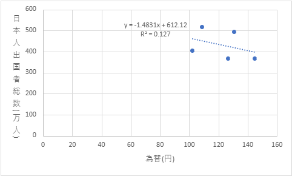

図2は、アメリカへの日本人出国者総数と為替の値動きを比較した相関図である。R²値が0.127と非常に低いことから、アメリカへの日本人出国者総数と為替の値動きとの関係性は非常に薄いことが伺える。係数の傾きが負であることから、円安に移行するにつれて日本からアメリカへの出国者数は減少していることが読み取れる。

**図3.アメリカへの日本人出国者総数とアメリカの世界遺産数の相関図**
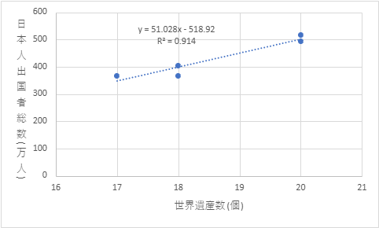

図3は、アメリカへの日本人出国者総数とアメリカの世界遺産数を比較した相関図である。 R²値が0.914と非常に高いことから、アメリカへの日本人出国者総数とアメリカの世界遺産数との関係性は非常に濃いことが伺える。係数の傾きが正であることから、アメリカの世界遺産数が増加するとアメリカへの日本人出国者総数も増加するという関係性が読み取れる。

**図4. アメリカへの日本人出国者総数とアメリカの1人当たりGDPの相関図**
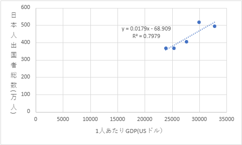

図4は、アメリカへの日本人出国者総数とアメリカの1人当たりGDPを比較した相関図である。 R²値が0.7979と非常に高いことから、アメリカへの日本人出国者総数とアメリカの1人当たりGDPとの関係性は非常に濃いことが伺える。係数の傾きが正であることから、アメリカの1人当たりGDPが増加するとアメリカへの日本人出国者総数も増加するという関係性が読み取れる。

**図5. アメリカへの日本人出国者総数とアメリカの輸入額の相関図**
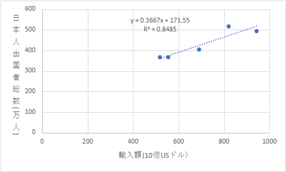

図5は、アメリカへの日本人出国者総数とアメリカの輸入額を比較した相関図である。 R²値が0.8485と非常に高いことから、アメリカへの日本人出国者総数とアメリカの輸入額との関係性は非常に濃いことが伺える。係数の傾きが正であることから、アメリカの輸入額が増加するとアメリカへの日本人出国者総数も増加するという関係性が読み取れる。

**図6. アメリカへの日本人出国者総数とアメリカの輸出額の相関図**
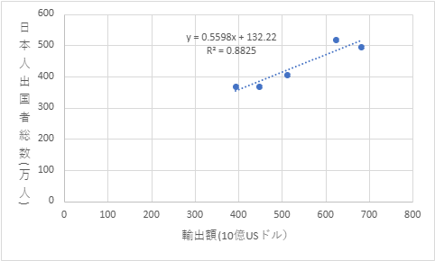

図6は、アメリカへの日本人出国者総数とアメリカの輸出額を比較した相関図である。 R²値が0.8825と非常に高いことから、アメリカへの日本人出国者総数とアメリカの輸出額との関係性は非常に濃いことが伺える。係数の傾きが正であることから、アメリカの輸出額が増加するとアメリカへの日本人出国者総数も増加するという関係性が読み取れる。

**図7.韓国への日本人出国者総数と為替の相関図**
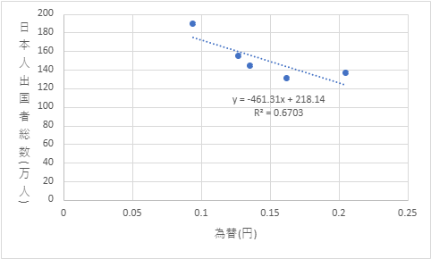

図7は、韓国への日本人出国者総数と為替の値動きを比較した相関図である。R²値が0.6703と高いことから、韓国の日本人出国者総数と為替の値動きとの関係性は濃いことが伺える。係数の傾きが負であることから、円安に移行するにつれて日本から韓国への出国者数は減少していることが読み取れる。

**図8. 韓国への日本人出国者総数と韓国の世界遺産数の相関図**
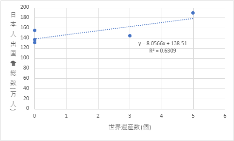

図8は、韓国への日本人出国者総数と韓国の世界遺産数を比較した相関図である。 R²値が0.6309と高いことから、韓国への日本人出国者総数と韓国の世界遺産数との関係性は濃いことが伺える。係数の傾きが正であることから、韓国の世界遺産数が増加すると韓国への日本人出国者総数も増加するという関係性が読み取れる。

**図9. 韓国への日本人出国者総数と韓国の1人当たりGDPの相関図**
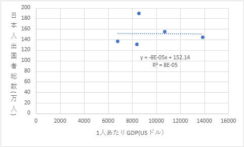

図9は、韓国の日本人出国者総数と韓国の1人当たりGDPを比較した相関図である。 R²値が8E-05と非常に低いことから、韓国への日本人出国者総数韓国の1人当たりGDPとの関係性は非常に薄いことが伺える。

**図10. 韓国への日本人出国者総数と韓国の輸入額の相関図**
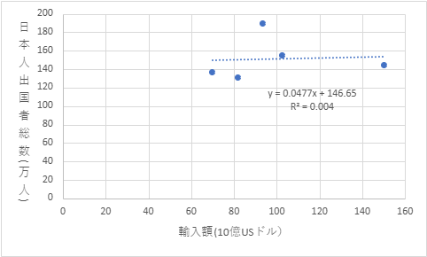

図10は、韓国への日本人出国者総数と韓国の輸入額を比較した相関図である。 R²値が0.004と非常に低いことから、韓国の日本人出国者総数と韓国の輸入額との関係性は非常に薄いことが伺える。

**図11. 韓国への日本人出国者総数と韓国の輸出額の相関図**
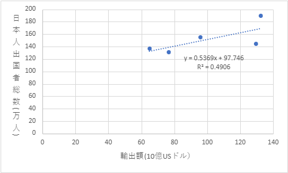

図11は、韓国への日本人出国者総数と韓国の輸出額を比較した相関図である。 R²値が0.4906と高くはないことから、韓国への日本人出国者総数と韓国の輸出額との関係性はあまり濃くないことが伺える。係数の傾きが正であることから、韓国の輸出額が増加すると韓国への日本人出国者総数も増加するという関係性が読み取れる。

**図12. 中国への日本人出国者総数と為替の相関図**
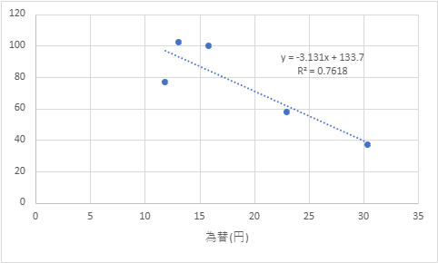

図12は、中国への日本人出国者総数と為替の値動きを比較した相関図である。R²値が0.7618と非常に高いことから、中国への日本人出国者総数と為替の値動きとの関係性は非常に濃いことが伺える。係数の傾きが負であることから、円安に移行するにつれて日本から中国への出国者数は減少していることが読み取れる。

**図13. 中国への日本人出国者総数と中国の世界遺産数の相関図**
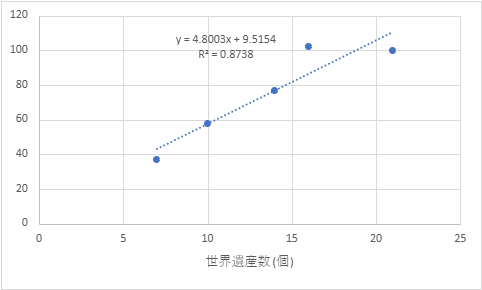

図13は、中国への日本人出国者総数と中国の世界遺産数を比較した相関図である。 R²値が0.8738と非常に高いことから、中国への日本人出国者総数と中国の世界遺産数との関係性は濃いことが伺える。係数の傾きが正であることから、中国の世界遺産数が増加すると中国への日本人出国者総数も増加するという関係性が読み取れる。

**図14. 中国への日本人出国者総数と中国の1人当たりGDPの相関図**
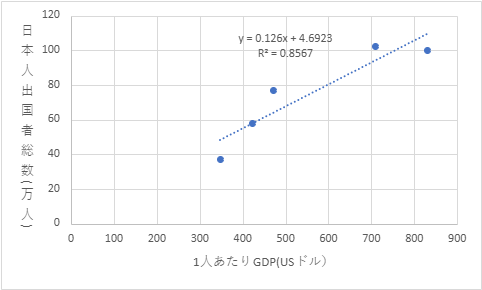

図14は、中国への日本人出国者総数と中国の1人当たりGDPを比較した相関図である。 R²値が0.8567と非常に高いことから、中国への日本人出国者総数と中国の1人当たりGDPとの関係性は非常に濃いことが伺える。係数の傾きが正であることから、中国の1人当たりGDPが増加すると中国への日本人出国者総数も増加するという関係性が読み取れる。

**図15. 中国への日本人出国者総数と中国の輸入額の相関図**
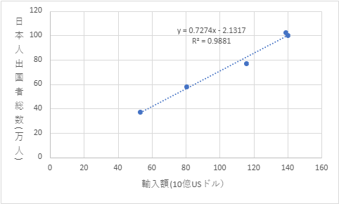

図15は、中国への日本人出国者総数と中国の輸入額を比較した相関図である。 R²値が0.9881と非常に高いことから、中国の日本人出国者総数と中国の輸入額との関係性は非常に濃いことが伺える。係数の傾きが正であることから、中国の輸入額が増加すると中国への日本人出国者総数も増加するという関係性が読み取れる。

**図16. 中国への日本人出国者総数と中国の輸出額の相関図**
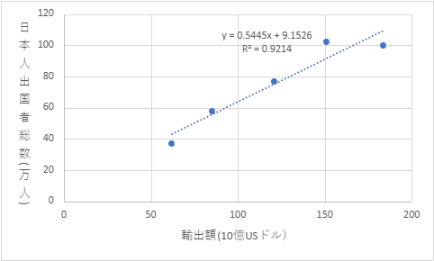

図16は、中国への日本人出国者総数と中国の輸出額を比較した相関図である。 R²値が0.9214と非常に高いことから、中国への日本人出国者総数と中国の輸出額との関係性は非常に濃いことが伺える。係数の傾きが正であることから、中国の輸出額が増加すると中国への日本人出国者総数も増加するという関係性が読み取れる。
### (4) 香港

香港は1990年代を通じてアジア随一の商業都市として栄え、日本人観光客にとっても「ショッピングと都市観光」の両方を楽しめる目的地であった。免税制度のもとで高級ブランド品や電子機器が安価に入手できる点が魅力とされ、買い物目的の旅行が特に多かった。  
1997年の中国返還は香港を国際的な注目の的とし、その前後数年間は政治的節目を見届ける目的で訪れる観光客も少なくなかった。また、航空ネットワークの利便性が高く、短期滞在の都市観光や東南アジアへの乗り継ぎ地としての機能も評価されていた。これらの要因から、香港は1990年代における日本人旅行者の定番都市として位置づけられた。

**表5. 香港への日本人出国者総数内訳 (単位：%)**

| 香港 | 日本人出国者総数 | 仕事等 | 学業等 | 居住等 | 観光等 |
|------|------------------|--------|--------|--------|--------|
| 1990 | 100              | 9.7    | 0.4    | 0.8    | 89.0   |
| 1992 | 100              | 12.0   | 0.3    | 0.9    | 86.8   |
| 1994 | 100              | 15.8   | 0.4    | 1.1    | 82.7   |
| 1996 | 100              | 11.8   | 0.3    | 0.7    | 87.2   |
| 1998 | 100              | 27.7   | 0.5    | 2.0    | 69.8   |

**図17. 香港への日本人出国者総数と為替の相関図**
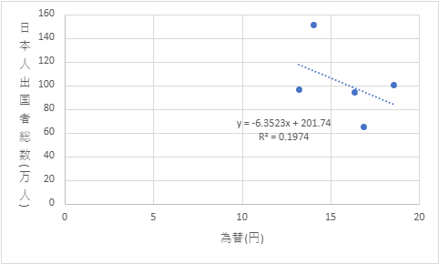

図17は、香港への日本人出国者総数と為替の値動きを比較した相関図である。R²値が0.1974と低いことから、香港への日本人出国者総数と為替の値動きとの関係性は薄いことが伺える。係数の傾きが負であることから、円安に移行するにつれて日本から香港への出国者数は減少していることが読み取れる。

**図18. 香港への日本人出国者総数と香港の世界遺産数の相関図**
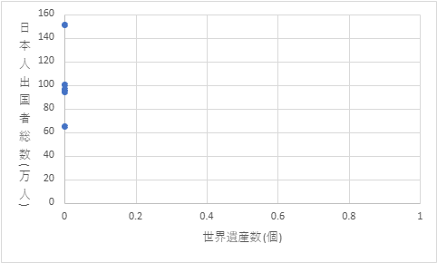

図18は、香港への日本人出国者総数と香港の世界遺産数を比較した相関図であるが、香港には世界遺産がないため、日本人出国者総数との関係性を調べることはできない。

**図19. 香港への日本人出国者総数と香港の1人当たりGDPの相関図**
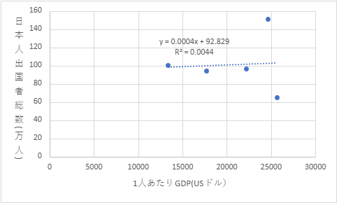

図19は、香港への日本人出国者総数と香港の1人当たりGDPを比較した相関図である。 R²値が0.0044と非常に低いことから、香港への日本人出国者総数と香港の1人当たりGDPとの関係性はほとんどないことが伺える。

**図20. 香港への日本人出国者総数と香港の輸入額の相関図**
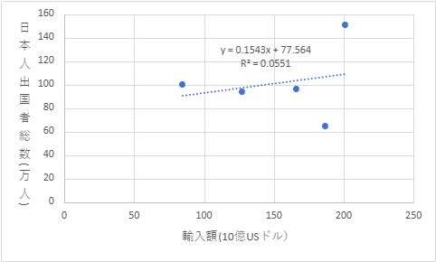

図20は、香港への日本人出国者総数と香港の輸入額を比較した相関図である。 R²値が0.0551と非常に低いことから、香港の日本人出国者総数と香港の輸入額との関係性はほとんどないことが伺える。

**図21. 香港への日本人出国者総数と香港の輸出額の相関図**
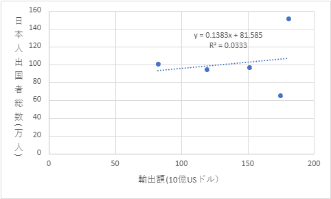

図21は、香港への日本人出国者総数と香港の輸出額を比較した相関図である。 R²値が0.0333と非常に低いことから、香港の日本人出国者総数と香港の輸出額との関係性はほとんどないことが伺える。
### (5) 台湾

台湾は地理的近接性に加え、歴史的・文化的な親近感が強く、日本人旅行者にとって心理的距離が短い目的地であった。1990年代における台湾観光は、食文化・ナイトマーケット・伝統文化体験など、多様な魅力を背景に拡大した。特に中高年層の観光や家族旅行において人気が高く、治安の良さや日本語対応の容易さが渡航促進の要因であった。  
また、台湾政府が日本人観光客を重要なターゲットとみなして観光インフラの整備を進めたことも寄与した。1990年代末には格安航空券の普及により、若年層の個人旅行も増加傾向を示した。

**表6.台湾への日本人出国者総数内訳 (単位：%)**

| 台湾 | 日本人出国者総数 | 仕事等 | 学業等 | 居住等 | 観光等 |
|------|------------------|--------|--------|--------|--------|
| 1990 | 100              | 15.9   | 0.5    | 0.5    | 83.1   |
| 1992 | 100              | 19.7   | 0.5    | 0.5    | 79.3   |
| 1994 | 100              | 21.9   | 0.5    | 0.5    | 77.1   |
| 1996 | 100              | 25.1   | 0.5    | 0.4    | 74.0   |
| 1998 | 100              | 29.7   | 0.6    | 0.6    | 69.2   |

**図22. 台湾への日本人出国者総数と為替の相関図**
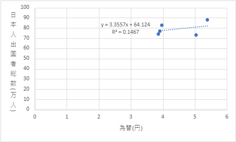

図22は、台湾への日本人出国者総数と為替の値動きを比較した相関図である。R²値が0.1467と低いことから、台湾への日本人出国者総数と為替の値動きとの関係性は薄いことが伺える。係数の傾きが正であることから、円安に移行するにつれて日本から台湾への出国者数は増加していることが読み取れる。

**図23. 台湾への日本人出国者総数と台湾の世界遺産数の相関図**
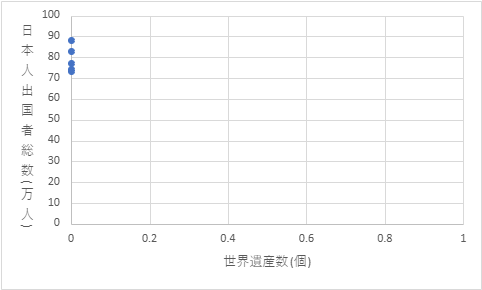

図23は、台湾への日本人出国者総数と台湾の世界遺産数を比較した相関図であるが、台湾には世界遺産がないため、日本人出国者総数との関係性を調べることはできない。

**図24. 台湾への日本人出国者総数と台湾の1人当たりGDPの相関図**
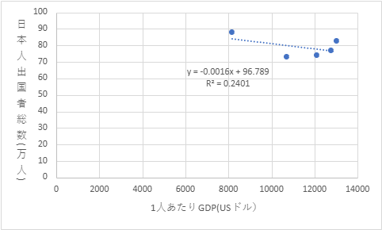

図24は、台湾への日本人出国者総数と台湾の1人当たりGDPを比較した相関図である。 R²値が0.2401と低いことから、台湾への日本人出国者総数と台湾の1人当たりGDPとの関係性は薄いことが伺える。係数の傾きが負であることから、台湾の1人当たりGDPが増加すると台湾への日本人出国者総数は減少するという関係性が読み取れる。

**図25. 台湾の日本人出国者総数と台湾の輸入額の相関図**
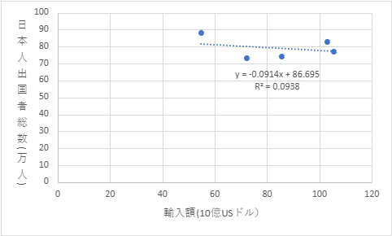

図25は、台湾への日本人出国者総数と台湾の輸入額を比較した相関図である。 R²値が0.0938と非常に低いことから、台湾への日本人出国者総数と台湾の輸入額との関係性はほとんどないことが伺える。

**図26. 台湾への日本人出国者総数と台湾の輸出額の相関図**
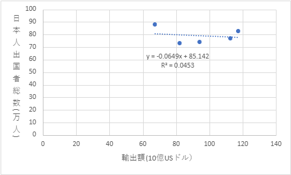

図26は、台湾への日本人出国者総数と台湾の輸出額を比較した相関図である。 R²値が0.0453と非常に低いことから、台湾への日本人出国者総数と台湾の輸出額との関係性はほとんどないことが伺える。
### (6) イタリア

イタリアは有数の世界遺産保有国であり、日本人にとって文化・芸術を体験する旅の代表的な目的地であった。1990年代の日本では美術展やヨーロッパ文化への関心が高まり、フィレンツェやローマなどの古都を巡るツアーが人気を博した。  
為替面では円高傾向が続いた時期には欧州旅行が割安感を持たれ、長期休暇を利用したハネムーンや記念旅行の需要が伸びた。また、イタリア料理やファッションなどの文化的イメージも好意的に受け取られ、メディア露出と相まって「一度は訪れたい国」としての地位を確立した。

**表7.イタリアへの日本人出国者総数内訳 (単位：%)**

| イタリア | 日本人出国者総数 | 仕事等 | 学業等 | 居住等 | 観光等 |
|----------|------------------|--------|--------|--------|--------|
| 1990     | 100              | 20.6   | 2.1    | 1.0    | 76.0   |
| 1992     | 100              | 14.2   | 1.8    | 0.6    | 83.4   |
| 1994     | 100              | 10.1   | 1.3    | 0.4    | 88.2   |
| 1996     | 100              | 8.5    | 1.0    | 0.3    | 90.2   |
| 1998     | 100              | 7.7    | 1.1    | 0.3    | 90.9   |

**図27. イタリアへの日本人出国者総数と為替の相関図**
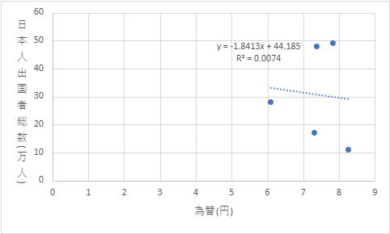

図27は、イタリアへの日本人出国者総数と為替の値動きを比較した相関図である。R²値が0.0074と非常に低いことから、イタリアへの日本人出国者総数と為替の値動きとの関係性はほとんどないことが伺える。

**図28. イタリアへの日本人出国者総数とイタリアの世界遺産数の相関図**
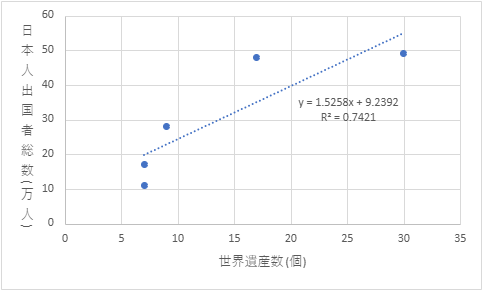

図28は、イタリアへの日本人出国者総数とイタリアの世界遺産数を比較した相関図である。 R²値が0.7421と高いことから、イタリアへの日本人出国者総数とイタリアの世界遺産数との関係性は濃いことが伺える。係数の傾きが正であることから、イタリアの世界遺産数が増加するとイタリアへの日本人出国者総数も増加するという関係性が読み取れる。

**図29. イタリアの日本人出国者総数とイタリアの1人当たりGDPの相関図**
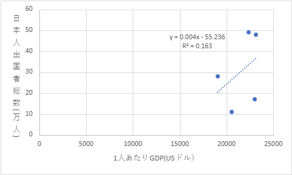

図29は、イタリアへの日本人出国者総数とイタリアの1人当たりGDPを比較した相関図である。 R²値が0.163と低いことから、イタリアへの日本人出国者総数とイタリアの1人当たりGDPとの関係性は薄いことが伺える。係数の傾きが正であることから、イタリアの1人当たりGDPが増加するとイタリアへの日本人出国者総数も増加するという関係性が読み取れる。

**図30. イタリアへの日本人出国者総数とイタリアの輸入額の相関図**
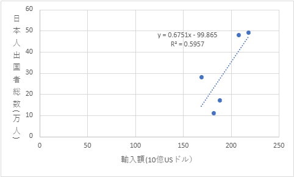

図30は、イタリアへの日本人出国者総数とイタリアの輸入額を比較した相関図である。 R²値が0.5957と高いことから、イタリアの日本人出国者総数とイタリアの輸入額との関係性は濃いことが伺える。係数の傾きが正であることから、イタリアの輸入額が増加するとイタリアへの日本人出国者総数も増加するという関係性が読み取れる。

**図31. イタリアへの日本人出国者総数とイタリアの輸出額の相関図**
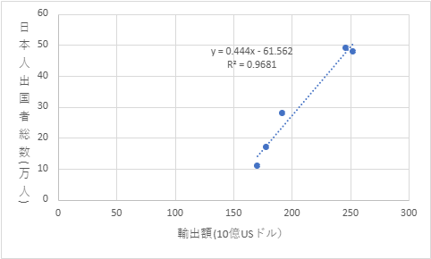

図31は、イタリアへの日本人出国者総数とイタリアの輸出額を比較した相関図である。 R²値が0.9681と高いことから、イタリアの日本人出国者総数とイタリアの輸出額との関係性は濃いことが伺える。係数の傾きが正であることから、イタリアの輸出額が増加するとイタリアへの日本人出国者総数も増加するという関係性が読み取れる。

## 6章　日本人の海外出国者が増えることによる影響について
　日本からの海外出国者数が増加することにより、主に三つの影響があると考えられる。一つ目は国際交流が行われることによる文化的な影響、二つ目は為替や国際収支への経済的な影響、三つ目はグローバルな人材が増加することによる社会的な影響である。

　まず一つ目の文化的な影響の観点から見ると、日本人の海外出国者数の増加は、国際社会における文化交流を一層活発化させ、日本人の価値観や文化的アイデンティティの形成にも影響を与えている。海外への旅行や留学、ワーキングホリデーや仕事などを通じて多くの人々が異なる文化圏で生活し、現地の習慣や生活様式、考え方に直接触れる機会を得るようになった。このような体験は多様性を受け入れる柔軟な思考を育む契機となっている。また、文化的差異を理解し、異なる背景をもつ人々と協働する力は、グローバル社会で求められる基本的な資質の一つであり、教育的にも重要な意味をもつ。

　さらに、日本人が海外で生活することで、現地社会に日本文化を伝えることができる。日本食やアニメ、ファッションなどのポップカルチャーは既に国際的な人気を獲得しており、渡航者が日常生活の中でそれらを紹介することによって、日本のソフトパワーが拡大している。特に若年層による留学や短期滞在を通じた交流は、国家的な文化外交よりも柔軟で身近な形で日本文化を発信する手段となっている。このような文化的影響は単に日本文化の普及にとどまらず、他国との相互理解や信頼関係の構築にも寄与しており、国際関係における人的基盤の強化につながっている。

　一方で、海外への渡航の増加には負の側面も存在する。短期消費的な観光が中心となる場合、現地文化を表面的に消費するだけで終わり、真の意味での文化理解には至らないことがある。また、異文化間の誤解やマナーの違いから、現地社会との摩擦が生じる可能性も考えられる。さらに、海外経験がある人とそうでない人との間で価値観や意識の格差が広がり、国内における文化的分断を生む可能性も否定できない。このように、海外出国者数の増加は文化の交流と相互理解を促進する一方で、新たな課題も生み出している。異文化体験を通じて得られる多様な価値観を、国内社会の中でどのように活かしていくかが、今後の日本社会における重要な課題であるといえる。

　次に二つ目の経済的な影響の観点から見ると、日本人の海外出国者数の増加は、国際収支だけでなく、為替・貿易・投資など多様な経済活動にも影響を及ぼしている。海外旅行や留学などに伴う支出の増加は、国際収支のうち旅行収支の支払額を増大させる要因となる。日本人が現地で宿泊や食料、買い物などに費やすことで、国内からの資金流出が発生し、短期的にはサービス収支の赤字を拡大させる可能性がある。

　また、海外への渡航者増加は為替市場にも間接的な影響を及ぼす。日本人による海外旅行支出や海外投資が増えれば外貨需要が高まり、円売り圧力として円安要因となり得る。一方で、円安が進行すると海外旅行費用の上昇によって出国者数が減少する傾向が見られるなど、為替と渡航行動の間には相互作用が存在する。為替相場は観光や消費活動を通じて国民の購買行動に影響を与えると同時に、外貨需要の変化を通して市場の動向にも揺らぎを生じさせるため、渡航者の動きは為替市場における一つの経済指標ともなり得る。

　さらに、海外出国の増加は日本企業の貿易や投資活動にも影響する。企業関係者が海外市場に直接赴くことで、現地の需要や取引先との関係構築が進み、輸出入取引の拡大や新たな投資機会の創出につながる。

　このように、日本人の海外出国者数の増加は短期的には旅行収支や為替を通じてマクロ経済に影響を与え、長期的には貿易・投資・産業の国際化を促進する要因となっている。その影響は一方向ではなく、為替や外需の変動と相互に作用しながら、日本経済の構造変化に関わっているといえる。

　最後に三つ目の社会的な影響の観点から見ると、留学や海外勤務などを通じて国際的な環境で経験を積む人々が増えることでグローバル人材の育成が進み、国内社会の人材構成や労働市場に変化をもたらしている。文部科学省の「日本人の海外留学者数」によると、2023年度には大学等が把握しているのみで約9万人の学生が海外留学を経験しており、コロナ禍以前の水準へと回復しつつある。このような人々が帰国後に異文化間コミュニケーション能力や柔軟な思考力を活かして国内で活躍することは、日本社会の国際的な適応力を高めるうえで重要な要素となっている。

　また、海外での生活や就労を通じて現地の社会制度や価値観に触れることは、日本社会の課題解決に新たな視点をもたらす契機となる。これにより、従来の長時間労働や年功序列型の職場文化に変化が生じ、多様な働き方を認める社会的風土が形成されつつある。

　さらに、国際的な人の往来が活発化することで、国内の地域社会にも多様性が浸透している。外国人労働者や観光客との接点が増える中で、異文化理解教育や多言語対応の必要性が高まり、地域レベルでの国際共生への意識が広がっている。これにより、社会全体として異文化を受け入れる寛容性が育まれ、より開かれた社会へと発展していくことが期待される。

　このように、日本からの海外出国者数の増加は、単に個人の経験にとどまらず、社会の価値観や制度、教育、労働環境など多方面に波及効果をもたらしている。特に、海外での経験を持つ人々が橋渡し役となることで、日本社会はより柔軟で国際的な視野を持った方向へと進化しているといえる。

| 相関係数              | 日本人出国者総数 | 為替（日本円換算） | 距離(km)    | 世界遺産数（個） | 1人あたりGDP(USドル） | 貿易額 |
|-----------------------|------------------|--------------------|-------------|------------------|-----------------------|--------|
| 日本人出国者総数      | 1                |                    |             |                  |                       |        |
| 為替（日本円換算）    | 0.023259693      | 1                  |             |                  |                       |        |
| 距離(km)              | 0.489093198      | -0.406305948       | 1           |                  |                       |        |
| 世界遺産数（個）      | 0.436902154      | -0.303421351       | 0.67613915  | 1                |                       |        |
| 1人あたりGDP(USドル） | 0.529313305      | -0.254989973       | 0.754026067 | 0.252717842      | 1                     |        |
| 貿易額                | 0.899171792      | -0.250279457       | 0.7633372   | 0.632870866      | 0.721797155           | 1      |

## 7章　回帰分析
本章では、日本人海外出国者数に影響を与える要因を明らかにするため、回帰分析を実施した。被説明変数は国別の日本人出国者数(単位:人)を設定し、説明変数として為替レート変動、距離、世界遺産数、1人当たりGDP、貿易総額を用いた。

Y ＝ α ＋ β₁X₁ ＋ β₂X₂ ＋ β₃X₃ ＋ β₄X₄ ＋ β₅X₅ ＋ β₆X₆ ＋ ε

- Y＝国別の日本人出国者数(人)
- X1＝為替(日本円換算)
- X2＝距離(km)
- X3＝世界遺産数(個)
- X4＝1人あたりGDP(USドル)
- X5＝輸入額(10億USドル)
- X6＝輸出額(10億USドル)

**表8　回帰分析の結果**

|                       | 係数    | 標準誤差 | t      | P-値  |
|-----------------------|---------|----------|--------|-------|
| 切片                  | 425,844 | 200,565  | 2.123  | 0.045 |
| 為替（日本円換算）    | 85,879  | 26,927   | 3.189  | 0.004 |
| 距離(km)              | -62     | 42       | -1.472 | 0.155 |
| 世界遺産数（個）      | -23,471 | 21,898   | -1.072 | 0.295 |
| 1人あたりGDP(USドル） | -29     | 19       | -1.572 | 0.130 |
| 輸入額(10億USドル）   | 6,503   | 3,387    | 1.920  | 0.067 |
| 輸出額(10億USドル）   | 1,929   | 5,648    | 0.341  | 0.736 |

回帰分析の結果、有意水準10％において統計的に有意と認められた変数は、為替と輸入額であった。まず、為替の係数は85,879と正の値を示しており、有意の結果となった。これは円安になればなるほど海外旅行者は減少し、円高になればなるほど海外旅行者は増加する傾向がある。この結果は円高になることで海外貨幣の価値が下がり手持ちの日本円を多くの外資に両替することができ、日本円の価値（購買力）が高くなっていることが関係している可能性がある。次に、距離及び世界遺産数の係数はそれぞれまた

、1人あたりGDP（USドル）は⁻29と負の値を示しており、その国のGDPの値が上昇するほど海外旅行者が減少する傾向にあるという結果になった。1人あたりGDPは国民の豊かさを表しているため一見するとこの結果には違和感を覚えるが1人あたりGDPが高い国の特徴として物価が水準が高いという点がある。この点が海外旅行者の足を遠ざけている要因である可能性がある。次に輸入額の係数は6,503と正の値を示しており、輸入額が減少すればするほど海外旅行者は減少し、輸入額が増えれば増えるほど海外旅行者は増加する傾向があるといえる。輸入額と海外旅行者の関係としていえるのは輸入額の価が大きいということは輸入先の国の特産品や取引商品が日本国内で人気があり、本場の料理や品物を求めて旅行者が増えていると予想できる。そして輸出額の係数は1,929と正の値を示しており、輸入額と同様輸出額が減少すればするほど海外旅行者は減少し、輸入額が増えれば増えるほど海外旅行者は増加する傾向がある。輸出額の値が大きいということは日本と輸出先の国との間で交友があるため、その国が日本国内で広く認知されているということである。そのため日本人が輸出先の国へ旅行に行くハードルが低くなっており旅行者が増加する傾向にあると予測できる。

以上の結果から、日本人海外出国者数が最も強い影響を受ける要因は為替レートであることが明らかになった。円高では日本円の購買力向上に伴って海外旅行のハードルが下がり出国者が増加する一方、近年の円安局面では経済的負担感から旅行者が大きく抑制される傾向が裏付けられたといえる。

## 8章　結論
本論文では、1990年代における日本人海外出国者数の推移に着目し、為替レートの変動が海外出国者数にどのような影響を与えていたのかについて分析を行った。さらに、海外出国者数の増加に関係すると考えられる要因として、渡航先の世界遺産数、1人当たりGDP、輸入額、輸出額などにも注目し、国別の相関分析および回帰分析を行った。  
　分析の結果、1990年代の日本人海外出国者数は全体として増加傾向にあり、その背景には所得水準の上昇、航空輸送網やパッケージツアーの発展、国際的な交流の拡大など、複数の要因が存在していたことが分かった。また、1995年頃の円高局面では海外旅行の費用負担が相対的に軽くなり、出国者数が増加した一方、1997年以降の円安局面では海外旅行費用の上昇などにより、出国者数の伸びが鈍化していた。このことから、為替レートは日本人の海外渡航を考えるうえで重要な要因の一つであると考えられる。  
　また、渡航先別の分析では、為替レートと日本人出国者数との関係には国によって違いが見られた。韓国や中国では比較的高い相関が確認された一方、アメリカ、香港、台湾、イタリアでは相関が低い結果となった。このことから、海外出国者数は為替レートだけによって決まるものではなく、渡航先の地理的条件、観光資源、経済的なつながり、旅行目的など、複数の要因が関係していることが示唆された。  
　さらに回帰分析では、為替と輸入額が有意な変数として確認された。特に為替の係数は正の値を示しており、円高になるほど日本人海外出国者数が増加する傾向が確認された。この結果から、円の購買力が高まることによって海外旅行に対する経済的負担が軽減され、海外旅行への需要が高まる可能性が示された。一方で、世界遺産数や1人当たりGDPなどについては有意な関係は確認されなかった。  
　以上のことから、日本人海外出国者数には、為替レートが重要な影響を与えていることが明らかになった。しかし、海外旅行の動機は為替レートだけに左右されるものではなく、経済状況や渡航先の魅力など、さまざまな要因が複合的に作用していると考えられる。  
　近年の日本では円安が進行し、海外旅行にかかる費用負担が大きくなっている。そのため、今後の日本人海外旅行者数を考える際にも、為替レートの変動は重要な要素になると考えられる。本研究を通して、為替レートは単に金融市場における数値の変化ではなく、人々の旅行意欲や消費行動にも影響を与える身近な経済的要因であることが確認できた。

[「日本人学生の海外留学状況」及び「外国人留学生の在籍状況調査」について：文部科学省](https://www.mext.go.jp/a_menu/koutou/ryugaku/1412692_00003.htm)

## 参考文献
・出入国在留管庁「出入国管理統計統計表」

https://www.moj.go.jp/isa/policies/statistics/toukei_ichiran_nyukan.html
